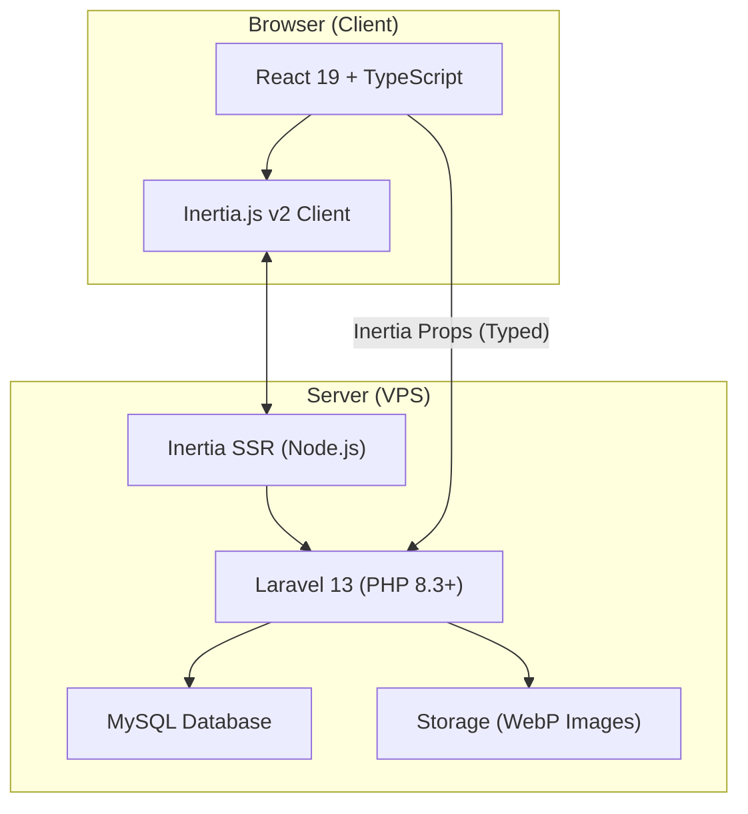
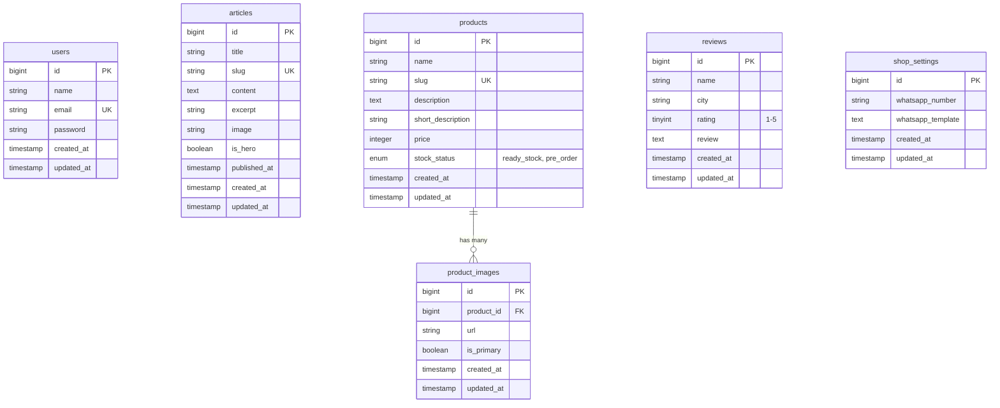

# 🪑 Implementation Plan — Agus Mebel Website & CMS

> **PRD Source:** `PRD_Agus_Mebel_v2.docx`
> **Stack:** Laravel 13 · Inertia.js v2 · React 19 · TypeScript · Tailwind CSS · MySQL
> **Timeline:** Juni – Akhir Agustus 2026
> **Engineer:** Fullstack (Solo)

---

## 📋 Ringkasan Proyek

Website penjualan furniture dan CMS untuk **Agus Mebel** (mebel Jepara). Terdiri dari:
- **Landing Page Publik** — SEO-optimized dengan SSR, Hero Section adaptif, katalog produk, blog artikel, dan review pelanggan
- **Dashboard Admin CMS** — CRUD artikel, produk, review, dan pengaturan toko (WhatsApp integration)

### Palet Warna (Earth Tone)
| Token | Warna | Kegunaan |
|-------|-------|----------|
| Primary | `amber-900` / `amber-950` | Cokelat Kayu — header, CTA, aksen utama |
| Secondary | `emerald-750` / `emerald-800` | Hijau Daun — badge, highlight, secondary CTA |
| Background | `slate-50` / `stone-100` | Cream/Off-white — latar belakang halaman |

---

## 🏗️ Arsitektur Sistem



### Route Map — Halaman Publik

| Route | Halaman | Komponen React |
|-------|---------|----------------|
| `/` | Halaman Utama | `Home.tsx` |
| `/produk` | List Produk | `Products/Index.tsx` |
| `/produk/{slug}` | Detail Produk | `Products/Show.tsx` |
| `/artikel` | List Artikel | `Articles/Index.tsx` |
| `/artikel/{slug}` | Detail Artikel | `Articles/Show.tsx` |

### Route Map — Admin CMS

| Route | Halaman | Komponen React |
|-------|---------|----------------|
| `/login` | Login Admin | `Auth/Login.tsx` |
| `/admin/dashboard` | Dashboard | `Admin/Dashboard.tsx` |
| `/admin/articles` | List Artikel | `Admin/Articles/Index.tsx` |
| `/admin/articles/create` | Tambah Artikel | `Admin/Articles/Form.tsx` |
| `/admin/articles/{id}/edit` | Edit Artikel | `Admin/Articles/Form.tsx` |
| `/admin/products` | List Produk | `Admin/Products/Index.tsx` |
| `/admin/products/create` | Tambah Produk | `Admin/Products/Form.tsx` |
| `/admin/products/{id}/edit` | Edit Produk | `Admin/Products/Form.tsx` |
| `/admin/reviews` | List Review | `Admin/Reviews/Index.tsx` |
| `/admin/reviews/create` | Tambah Review | `Admin/Reviews/Form.tsx` |
| `/admin/settings` | Pengaturan Toko | `Admin/Settings.tsx` |

---

## 🗄️ Database Schema



---

## 📦 TypeScript Contracts (`types/mebel.ts`)

```typescript
interface Product {
  id: number;
  name: string;
  slug: string;
  description: string;
  short_description: string;
  price: number;
  stock_status: 'ready_stock' | 'pre_order';
  images: ProductImage[];
  created_at: string;
}

interface ProductImage {
  id: number;
  url: string;
  is_primary: boolean;
}

interface Article {
  id: number;
  title: string;
  slug: string;
  content: string;
  excerpt: string;
  image: string;
  is_hero: boolean;
  published_at: string;
}

interface Review {
  id: number;
  name: string;
  city: string;
  rating: 1 | 2 | 3 | 4 | 5;
  review: string;
}

interface ShopSetting {
  whatsapp_number: string;
  whatsapp_template: string;
}
```

---

## 🗓️ Fase Pengembangan

### Fase 1 — Database & Backend Laravel 13 *(Juni 2026, Minggu 1-2)*

> [!IMPORTANT]
> Fondasi proyek. Semua fitur bergantung pada fase ini.

| # | Task | Label | Estimasi |
|---|------|-------|----------|
| 1 | Setup proyek Laravel 13 + Inertia v2 + React 19 + TS | `BE` `FE` | 1 hari |
| 2 | Install & konfigurasi Laravel Breeze (React + TS) | `BE` `FE` | 0.5 hari |
| 3 | Nonaktifkan fitur Register, konfigurasi auth middleware | `BE` | 0.5 hari |
| 4 | Buat migration: `articles` table | `BE` | 0.5 hari |
| 5 | Buat migration: `products` + `product_images` tables | `BE` | 0.5 hari |
| 6 | Buat migration: `reviews` table | `BE` | 0.5 hari |
| 7 | Buat migration: `shop_settings` table | `BE` | 0.5 hari |
| 8 | Buat Eloquent Models + relationships | `BE` | 1 hari |
| 9 | Buat DatabaseSeeder (admin user + shop_settings default) | `BE` | 0.5 hari |

### Fase 2 — TypeScript Structure & Sistem WebP *(Juni 2026, Minggu 3-4)*

| # | Task | Label | Estimasi |
|---|------|-------|----------|
| 10 | Buat file `types/mebel.ts` dengan semua interface | `FE` | 0.5 hari |
| 11 | Implementasi ImageService: konversi upload → WebP | `BE` | 1 hari |
| 12 | Implementasi ImageService: auto-resize max 1400px, quality 75-80% | `BE` | 0.5 hari |
| 13 | Buat ArticleController (CRUD) + validasi kuota hero max 3 | `BE` | 1.5 hari |
| 14 | Buat ProductController (CRUD) + multi-image upload | `BE` | 1.5 hari |
| 15 | Buat ReviewController (CRUD) | `BE` | 1 hari |
| 16 | Buat ShopSettingController (Read + Update) | `BE` | 0.5 hari |
| 17 | Buat PublicController: Home, Products, Articles | `BE` | 1 hari |

### Fase 3 — Frontend Publik & Layout Grid *(Juli 2026, Minggu 1-3)*

| # | Task | Label | Estimasi |
|---|------|-------|----------|
| 18 | ✅ Setup Tailwind CSS config (earth tone color palette) | `FE` | 0.5 hari |
| 19 | ✅ Buat komponen Layout publik (Navbar, Footer) | `FE` | 1 hari |
| 20 | ✅ Buat komponen Hero Section Grid Adaptif (1/2/3 artikel) | `FE` | 2 hari |
| 21 | ✅ Buat komponen ProductCard + WhatsApp CTA button | `FE` | 1 hari |
| 22 | ✅ Buat halaman Home: hero + katalog produk + review | `FE` | 1.5 hari |
| 23 | ✅ Buat halaman List Produk + filter/sorting | `FE` | 1.5 hari |
| 24 | ✅ Buat halaman Detail Produk + galeri foto | `FE` | 1.5 hari |
| 25 | ✅ Buat halaman List Artikel | `FE` | 1 hari |
| 26 | ✅ Buat halaman Detail Artikel (SEO semantic HTML) | `FE` | 1 hari |
| 27 | ✅ Implementasi komponen `<Head>` meta-tags dinamis | `FE` | 0.5 hari |
| 28 | ✅ Responsive design (mobile-first) semua halaman publik | `FE` | 2 hari |

### Fase 4 — CMS Admin Dashboard *(Juli 2026, Minggu 3-4)*

| # | Task | Label | Estimasi |
|---|------|-------|----------|
| 29 | Buat Layout Admin Dashboard (sidebar, header) | `FE` | 1 hari |
| 30 | Buat halaman Admin Artikel (CRUD + toggle Hero) | `FE` | 2 hari |
| 31 | Integrasi Rich Text Editor untuk konten artikel | `FE` | 1 hari |
| 32 | Buat halaman Admin Produk (CRUD + multi-image upload) | `FE` | 2 hari |
| 33 | Buat halaman Admin Review (CRUD) | `FE` | 1 hari |
| 34 | Buat halaman Pengaturan Toko (WA number + template) | `FE` | 1 hari |
| 35 | Implementasi React 19 Form Actions + validasi client-side | `FE` | 1 hari |
| 36 | Notifikasi flash messages (success/error) | `FE` `BE` | 0.5 hari |

### Fase 5 — Testing Performa & SEO *(Agustus 2026)*

| # | Task | Label | Estimasi |
|---|------|-------|----------|
| 37 | Setup & konfigurasi Inertia SSR di server | `BE` `FE` | 1 hari |
| 38 | Audit PageSpeed Insights — fix LCP (eager loading hero) | `FE` | 1 hari |
| 39 | Audit PageSpeed Insights — fix CLS (layout shift) | `FE` | 1 hari |
| 40 | Target: Mobile ≥ 85, Desktop ≥ 90 | `FE` | 2 hari |
| 41 | Testing end-to-end semua CRUD admin | `BE` `FE` | 2 hari |
| 42 | Deployment ke VPS produksi | `BE` | 1 hari |

---

## ✅ Acceptance Criteria

| Metrik | Target | Keterangan |
|--------|--------|------------|
| PageSpeed Mobile | ≥ 85 | Google PageSpeed Insights |
| PageSpeed Desktop | ≥ 90 | Google PageSpeed Insights |
| LCP | < 2.5 detik | Hero images `loading="eager"` |
| CLS | < 0.1 | No layout shift on load |

---

## 📂 Struktur File yang Direncanakan

```
agus-meubel/
├── app/
│   ├── Http/Controllers/
│   │   ├── Admin/
│   │   │   ├── ArticleController.php
│   │   │   ├── ProductController.php
│   │   │   ├── ReviewController.php
│   │   │   └── ShopSettingController.php
│   │   └── Public/
│   │       ├── HomeController.php
│   │       ├── ProductController.php
│   │       └── ArticleController.php
│   ├── Models/
│   │   ├── Article.php
│   │   ├── Product.php
│   │   ├── ProductImage.php
│   │   ├── Review.php
│   │   └── ShopSetting.php
│   └── Services/
│       └── ImageService.php
├── database/
│   ├── migrations/
│   └── seeders/
│       └── DatabaseSeeder.php
├── resources/js/
│   ├── Components/
│   │   ├── Public/
│   │   │   ├── Navbar.tsx
│   │   │   ├── Footer.tsx
│   │   │   ├── HeroSection.tsx
│   │   │   ├── ProductCard.tsx
│   │   │   └── ReviewCard.tsx
│   │   └── Admin/
│   │       ├── Sidebar.tsx
│   │       ├── DataTable.tsx
│   │       └── ImageUploader.tsx
│   ├── Layouts/
│   │   ├── PublicLayout.tsx
│   │   └── AdminLayout.tsx
│   ├── Pages/
│   │   ├── Home.tsx
│   │   ├── Products/
│   │   │   ├── Index.tsx
│   │   │   └── Show.tsx
│   │   ├── Articles/
│   │   │   ├── Index.tsx
│   │   │   └── Show.tsx
│   │   ├── Auth/
│   │   │   └── Login.tsx
│   │   └── Admin/
│   │       ├── Dashboard.tsx
│   │       ├── Articles/
│   │       │   ├── Index.tsx
│   │       │   └── Form.tsx
│   │       ├── Products/
│   │       │   ├── Index.tsx
│   │       │   └── Form.tsx
│   │       ├── Reviews/
│   │       │   ├── Index.tsx
│   │       │   └── Form.tsx
│   │       └── Settings.tsx
│   └── types/
│       └── mebel.ts
└── routes/
    └── web.php
```

---

## 🏷️ GitHub Labels

Untuk issue tracking, gunakan label berikut:

| Label | Warna | Deskripsi |
|-------|-------|-----------|
| `backend` | `#0E8A16` | Backend Laravel tasks |
| `frontend` | `#1D76DB` | Frontend React/TS tasks |
| `database` | `#FBCA04` | Migration & schema tasks |
| `auth` | `#D93F0B` | Authentication tasks |
| `seo` | `#5319E7` | SEO & performance tasks |
| `cms` | `#C2E0C6` | Admin CMS tasks |
| `phase-1` | `#BFD4F2` | Fase 1: Database & Backend |
| `phase-2` | `#BFD4F2` | Fase 2: TS & WebP |
| `phase-3` | `#BFD4F2` | Fase 3: Frontend Publik |
| `phase-4` | `#BFD4F2` | Fase 4: CMS Admin |
| `phase-5` | `#BFD4F2` | Fase 5: Testing & Deploy |

---

> [!NOTE]
> Plan ini dibuat berdasarkan PRD v2 tanggal 9 Juni 2026. Total estimasi: **~40 hari kerja** yang sesuai dengan timeline Juni–Agustus 2026.
